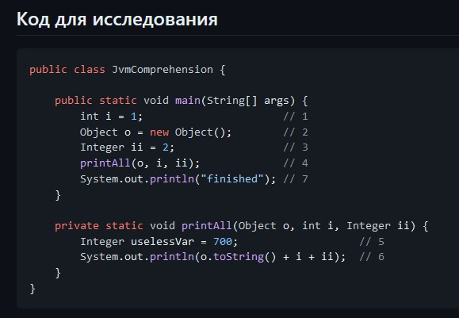

### Задача 
## "Понимание JVM"
### Выполнила Лариса Черная
 

Вначале JVM проверяет какие классы будут использоваться 
и с помощью подсистемы ClassLoader загружает класс JvmComprehension.
Далее происходит подготовка этого класса к выполнению:
 - проверка, что код валиден;
 - подготовка примитивов в статических полях;
 - связывание ссылок на другие классы.
Заканчивается этот этап инициализацией.

Вся информация о классе загружается в область памяти Metaspace.
После загрузки класса в области памяти StackMemory создается фрейм main().
1) в фрейме main() создается переменная i примитивного типа int и ей присваивается значение 1;
2) в heap в начале по оператору new будет выделена память под объект Object, потом отработает конструктор, который создать экземпляр объект. Во фрейме main() будет создана переменная o, которой будет присвоена ссылка на объект Object;
3) в heap будет создан объект примитивного типа Integer и ему будет присвоено значение 2. Во фрейме main() будет создана переменная ii, которая будет содержать ссылку на этот объект Integer;
4) далее у класса JvmComprehension будет вызван статический метод printAll(), под который в StackMemory создается новый фрейм printAll(), в котором создаются переменные o, i и ii. Переменной i будет присвоено значение 1. Переменные o и ii будут присвоены ссылки на объекты в heap, созданные на шаге 2 (o -> Object) и 3 (ii -> Integer);
5)  в heap будет создан объект примитивного типа Integer и ему будет присвоено значение 700. В фрейме printAll() будет создана переменная uselessVar, которая будет содержать ссылку на этот объект Integer;
6)  в StackMemory создается новый фрейм (System.out.println) в котором выполняется вывод на экран строки, являющейся конкатенацией результат выполнения метода toString объекта o, значения переменной i и значения переменной ii;
7)  в StackMemory создается новый фрейм (System.out.println) в котором выполняется вывод на экран строки finished.

После выхода из метода printAll(), фрейм отмечаются как не используемый. Но при запуске сборщика мусора объекты Object и Integer в heap не будут удалены, так как на них еще есть ссылки из фрейма main(). После выхода из main в heap будут удалены эти объекты, так как они больше не используются. 