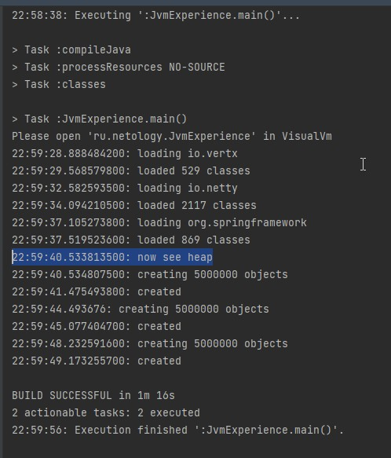
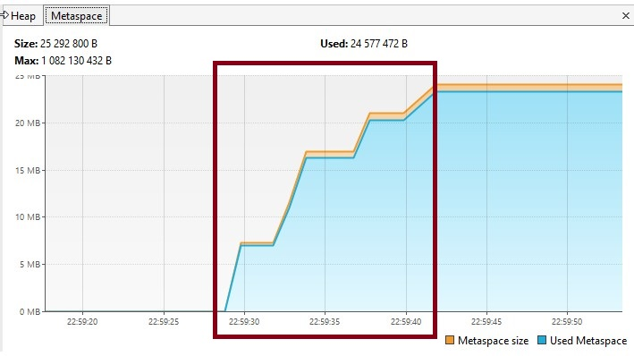
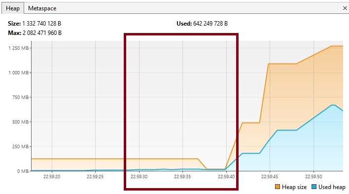
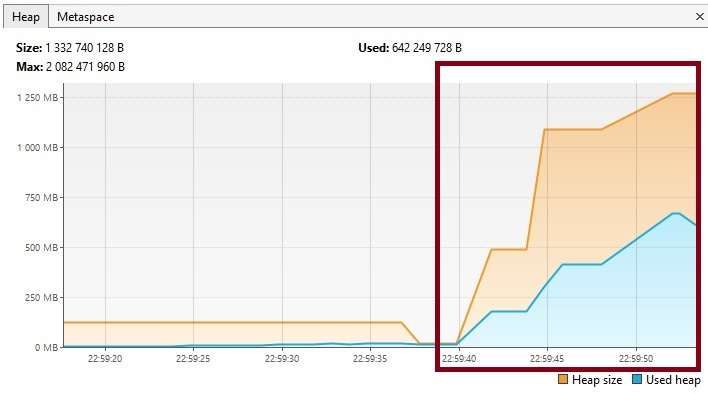
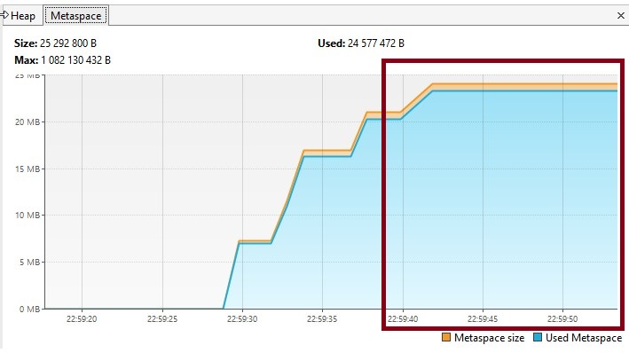
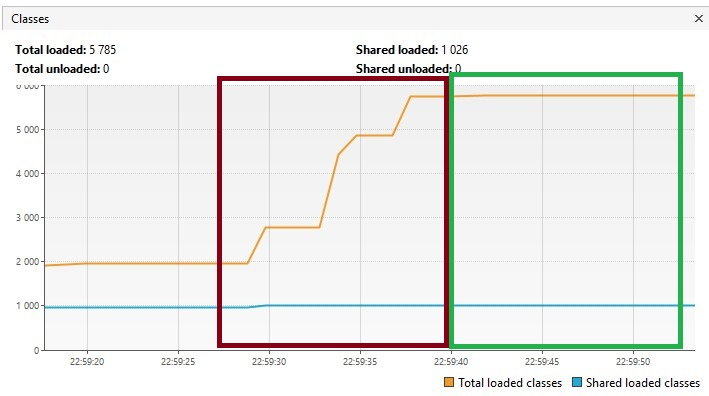

### Задача 
## "Исследование JVM через VisualVM"
### Выполнила Лариса Черная

Ниже на скриншоте отображен таймкод выполнения JvmExperience.main()

Выполнение началось в 22:58:38
И до 22:59:40.533813500 выполнялась загрузка классов.
На графиках монитора VisualVM видно, что до этого времени возрастало использование области памяти Metaspace, которая как раз и используется для загрузки классов.

При этом heap в этот период времени практически не увеличивается.

После загрузки классов с 22:59:40 начинается создание экземпляров объектов, которые создаются в области памяти Heap (куча). 
На графиках монитора VisualVM видно, что с этого времени резко начинается увеличиваться использование Heap,

 а размер MetaSpace не изменяется
 

Это же показывает график Classes

